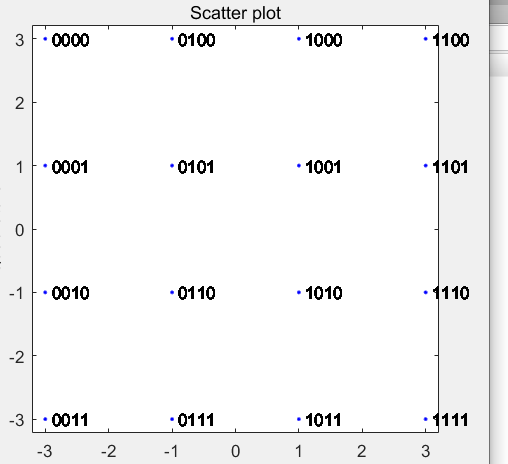
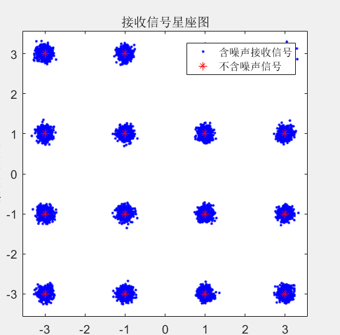
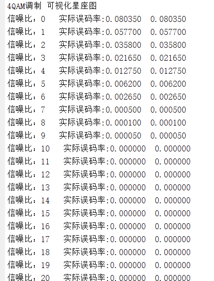
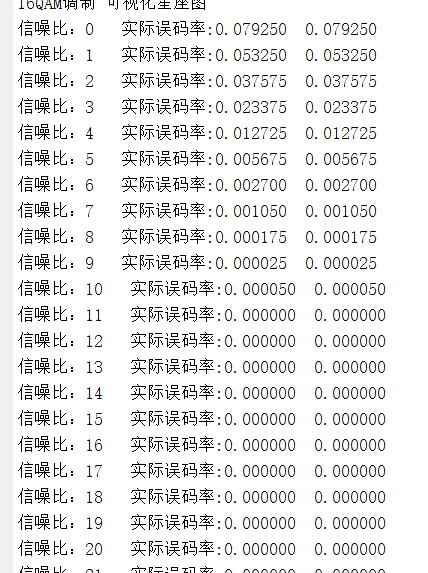
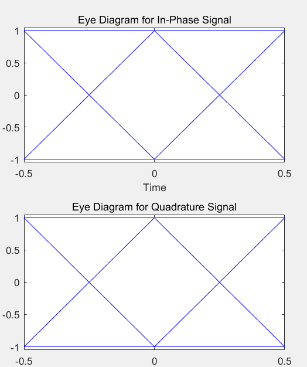
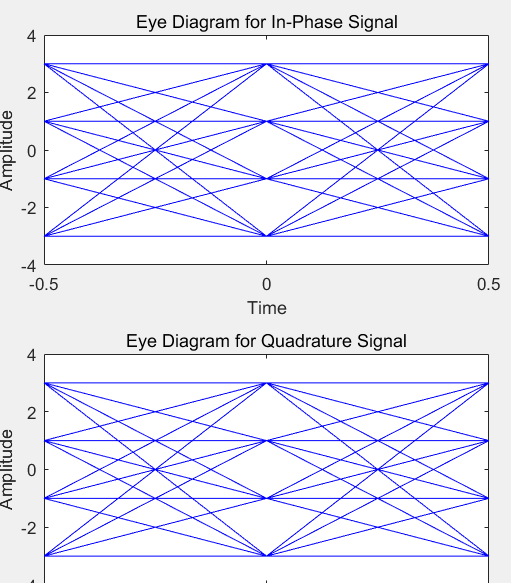
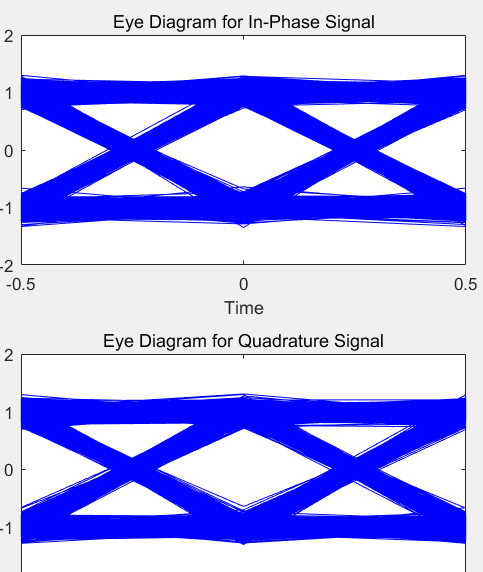
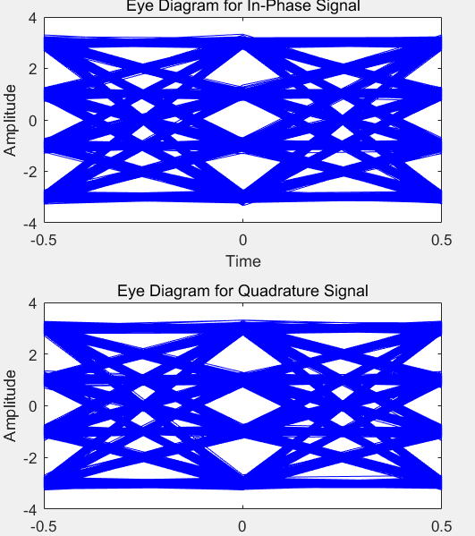
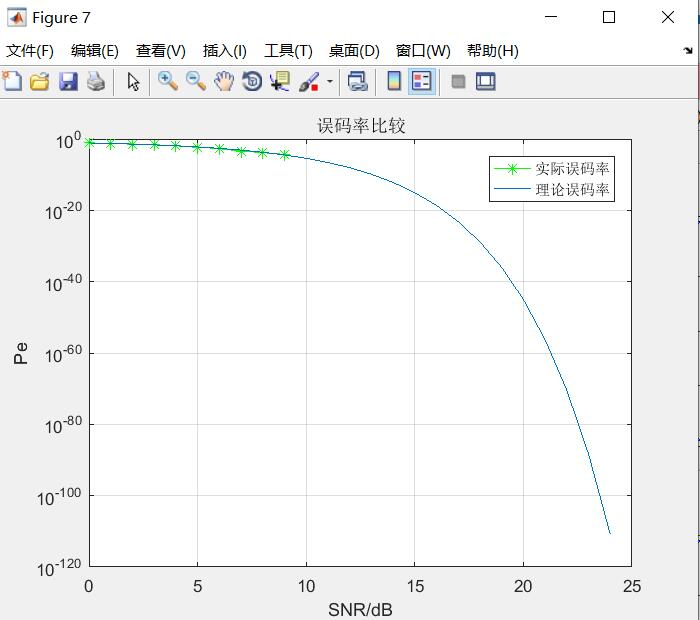
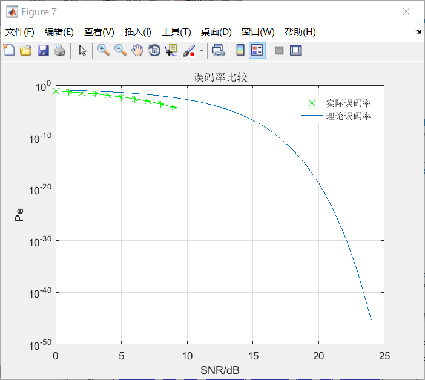

### QAM调制解调的仿真实现（b测）         

**2021年05月10日**

**组队ID：3212**

| **姓名** | **学号**    | **学院**             |
| -------- | ----------- | -------------------- |
| 张帅豪   | 18030100101 | 计算机科学与技术学院 |
| 赵宇轩   | 18030100103 | 计算机科学与技术学院 |
| 贾景元   | 18130500232 | 软件工程             |

**教师指导评语**：


​                                                                                                **成      绩**

​     


​                                                                                     **测试教师**：


​                                                                                      年      月     日 


​																    **实验报告内容基本要求及参考格式**


一、题目要求

二、原理分析

三、需求方案

四、实验结果

五、附录代码


#### 一、题目要求

> 任务：使用MATLAB软件，实现对QAM系统调制与解调过程的仿真，然后分析系统的可靠性。

（1）对原始信号分别进行4QAM和16QAM调制，画出星座图；

（2）采用高斯白噪声信道传输信号，画出信噪比为18dB时，4QAM和16QAM的接收信号星座图；

（3）画出两种调制方式的眼图；

（4）解调接收信号，分别绘制4QAM和16QAM的误码率曲线图，并与理论值进行对比；

#### 二、原理分析

- **QAM概念**

 正交振幅调制（QAM）是用两个独立的基带数字信号对两个互相正交的同频载波进行抑制在播的双边带调制，利用这种已调信号在同一带宽内频谱正交的性质来实现两路并行的数字信息传输。它是把MASK与MPSK两种结合到一起的调制技术，使得带宽得到双倍拓展。

AM：振幅和相位联合键控的调制方式。
信号的一个码元可表示为：

![[公式]](https://www.zhihu.com/equation?tex=s_k%28t%29%3DA_kcos%28w_0t%2B%5Ctheta_k%29%2CkT%3C+t%5Cleq%28k%2B1%29T+%5C%5C)

将上式展开：

![[公式]](https://www.zhihu.com/equation?tex=s_k%28t%29%3DA_kcos%5Ctheta_kcosw_0t-A_ksin%5Ctheta_ksinw_0t+%5C%5C)

令![[公式]](https://www.zhihu.com/equation?tex=X_k%3DA_kcos%5Ctheta_k%2CY_k%3D-A_ksin%5Ctheta_k)，则信号变为：

![[公式]](https://www.zhihu.com/equation?tex=s_k%28t%29%3DX_kcosw_0t%2BY_ksinw_0t+%5C%5C)

![[公式]](https://www.zhihu.com/equation?tex=X_k)和![[公式]](https://www.zhihu.com/equation?tex=Y_k)是由振幅和相位决定的取离散值的变量。每一个码元可以看作是两个载波正交的振幅键控信号之和。

- **原理图（以16QAM为例）**


#### 三、需求方案

> （1）对原始信号分别进行4QAM和16QAM调制，画出星座图；

分析：

原始信号：我们创建10000*log2(QAM)个随机信号（0  or  1）将其转换为（0---(QAM-1)）的值

​					eg：01  --->  1  10--->2

​							0100-->4   1111-->15

```matlab
M = input('输入qam');
m=log2(M);
n=10000; %Random number.
x1=randi([0,1],m*n,1); %random bit stream.

[m1,n1] = size(x1);
fprintf('原始信号1 %d行%d列  最小值%d 最大值%d\n',m1,n1,min(x1),max(x1));
x2=reshape(x1,m,length(x1)/m);
[m2,n2] = size(x2);
fprintf('原始信号2 %d行%d列\n',m2,n2);
x3=bi2de(x2','left-msb');%将二进制随机序列转换为M进制序列
[m3,n3] = size(x3);
fprintf('原始信号3 %d行%d列  最小值%d 最大值%d 平均值%f\n',m3,n3,min(x3),max(x3),mean(x3));
```

| 4QAM                                              | 16QAM                                              |
| ------------------------------------------------- | -------------------------------------------------- |
|  |  |

QAM调制:使用qammod函数，调制根据M确定

```matlab
%（1）对原始信号分别进行4QAM和16QAM调制，画出星座图
fprintf('%dQAM调制 可视化星座图\n',M);
y=qammod(x1,M,'bin','InputType','bit');
```

星座图

```matlab
scatterplot(y);%MQAM星座图
text(real(y)+0.1,imag(y),dec2bin(x3));
hold on
```

> （2）采用高斯白噪声信道传输信号，画出信噪比为18dB时，4QAM和16QAM的接收信号星座图；

添加信噪比18db的噪声：使用awgn函数

```matlab
y_noisy=awgn(y,18);
```

添加噪声的接收信号图

```matlab
h=scatterplot(y_noisy,1,0,'b.');
hold on;
scatterplot(y,1,0,'r*',h);
title('接收信号星座图');
legend('含噪声接收信号','不含噪声信号');
hold on;
```

|            | 4QAM                                                         | 16QAM                                                        |
| ---------- | ------------------------------------------------------------ | ------------------------------------------------------------ |
| 原始信号   |  |  |
| 添加噪音后 |  |  |

> （3）画出两种调制方式的眼图

使用eyediagram函数

```matlab
eyediagram(y,2);
eyediagram(y_noisy,2);
```

> （4）解调接收信号，分别绘制4QAM和16QAM的误码率曲线图，并与理论值进行对比；

解调信号：使用qamdemod函数

```matlab
y_deqam1=qamdemod(y,M,'bin','OutputType','bit');%解调信号
figure
subplot(2,1,1);
stem(x1(1:100),'filled');            %基带信号前100位
title('基带二进制随机序列');
xlabel('比特序列');ylabel('信号幅度');
subplot(2,1,2);
stem(y_deqam1(1:100));                  %画出相应的经过QAM调制解调后的信号的前100位
title('解调后的二进制序列');
xlabel('比特序列');ylabel('信号幅度');
```

| 4QAM                                               | 16QAM                                            |
| -------------------------------------------------- | ------------------------------------------------ |
|  |  |

分析：可以看出解调后出错的比特很少。

理论误码率：使用berawgn函数，  format long可以提高数据精度

```matlab
SNR_in_dB1=0:1:24;
format long;
berQ = berawgn(SNR_in_dB1,'qam',M);
```

实际误码率:查看每个信噪比的噪音下，解调后的比特码流与初始的差别

```matlab
NR_in_dB=0:1:24; %AWGN信道信噪比;
for j=1:length(SNR_in_dB)
    format long;
    y_noise = awgn(y,SNR_in_dB(j));%加入不同强度的高斯白噪声;
    y_output = qamdemod(y_noise,M,'bin','OutputType','bit'); %对己调信号进行解调
    num=0;
    for i=1:length(x1)
        if (y_output(i)~=x1(i))
            num=num+1;
        end
    end

    [number, ratio] = biterr(x1,y_output);
    Pe0(j) = num/length(y_output);
    Pe(j) = number/length(y_output); 
end

```

(实际误码率)使用了for循环寻找和biterr查找两种方法对比，结果如下：

| 4QAM                                     | 16QAM                                      |
| ---------------------------------------- | ------------------------------------------ |
|  |  |

误码曲线图：

```matlab
igure();
semilogy(SNR_in_dB,Pe,'green*-');
hold on;
semilogy(SNR_in_dB1,berQ);
title('误码率比较');
legend('实际误码率','理论误码率');
hold on;
grid on;
```


#### 四、实验结果

|              | 4QAM                                       | 16QAM                                      |
| ------------ | ------------------------------------------ | ------------------------------------------ |
| 原始星座图   |    |    |
| 噪音后星座图 |  |  |
| 原始眼图     |                  |                  |
| 噪音后眼图   |                |                |
| 误码率曲线   |                  |                |


#### 五、附录代码


```matlab
clear;
clc;
close all;
%生成随机信号并转换为0-(M-1）%
M = input('输入qam');
m=log2(M);
n=10000; %Random number.
x1=randi([0,1],m*n,1); %random bit stream.
[m1,n1] = size(x1);
fprintf('原始信号1 %d行%d列  最小值%d 最大值%d\n',m1,n1,min(x1),max(x1));
x2=reshape(x1,m,length(x1)/m);
[m2,n2] = size(x2);
fprintf('原始信号2 %d行%d列\n',m2,n2);
x3=bi2de(x2','left-msb');%将二进制随机序列转换为M进制序列
[m3,n3] = size(x3);
fprintf('原始信号3 %d行%d列  最小值%d 最大值%d 平均值%f\n',m3,n3,min(x3),max(x3),mean(x3));
%（1）对原始信号分别进行4QAM和16QAM调制，画出星座图
fprintf('%dQAM调制 可视化星座图\n',M);
y=qammod(x1,M,'bin','InputType','bit');
scatterplot(y);%MQAM星座图
text(real(y)+0.1,imag(y),dec2bin(x3));
hold on
%（2）采用高斯白噪声信道传输信号，画出信噪比为18dB时，
%     4QAM和16QAM的接收信号星座图；
y_noisy=awgn(y,18);
h=scatterplot(y_noisy,1,0,'b.');
hold on;
scatterplot(y,1,0,'r*',h);
title('接收信号星座图');
legend('含噪声接收信号','不含噪声信号');
hold on;
% （3）画出两种调制方式的眼图；
eyediagram(y,2);
eyediagram(y_noisy,2);
%基带信号和解调信号图示%
y_deqam1=qamdemod(y,M,'bin','OutputType','bit');%解调信号
figure
subplot(2,1,1);
stem(x1(1:100),'filled');            %基带信号前100位
title('基带二进制随机序列');
xlabel('比特序列');ylabel('信号幅度');
subplot(2,1,2);
stem(y_deqam1(1:100));                  %画出相应的经过QAM调制解调后的信号的前100位
title('解调后的二进制序列');
xlabel('比特序列');ylabel('信号幅度');
%基带信号和解调信号图示%
y_deqam2=qamdemod(y_noisy,M,'bin','OutputType','bit');%解调信号
figure
subplot(2,1,1);
stem(x1(1:100),'filled');            %基带信号前100位
title('基带二进制随机序列');
xlabel('比特序列');ylabel('信号幅度');
subplot(2,1,2);
stem(y_deqam2(1:100));                  %画出相应的经过QAM调制解调后的信号的前100位
title('解调后的二进制序列');
xlabel('比特序列');ylabel('信号幅度');
%实际误差值%
SNR_in_dB=0:1:24; %AWGN信道信噪比;
for j=1:length(SNR_in_dB)
    format long;
    y_noise = awgn(y,SNR_in_dB(j));%加入不同强度的高斯白噪声;
    y_output = qamdemod(y_noise,M,'bin','OutputType','bit'); %对己调信号进行解调
    num=0;
    for i=1:length(x1)
        if (y_output(i)~=x1(i))
            num=num+1;
        end
    end

        [number, ratio] = biterr(x1,y_output);
    Pe0(j) = num/length(y_output);
    Pe(j) = number/length(y_output); %t通过错误码元数与总码元数之比求误码率，不同j是不同信噪比下的误码
end
%理论误差值%
SNR_in_dB1=0:1:24;
format long;
berQ = berawgn(SNR_in_dB1,'qam',M);

for j=1:length(SNR_in_dB)
    fprintf('信噪比：%d   实际误码率:%f  %f   \n',SNR_in_dB(j),Pe(j),Pe0(j));
end
%画图
figure();
semilogy(SNR_in_dB,Pe,'green*-');
hold on;
semilogy(SNR_in_dB1,berQ);
title('误码率比较');
legend('实际误码率','理论误码率');
hold on;
grid on;
xlabel('SNR/dB');
ylabel('Pe1');
```

