## hadoop和spark使用

学生：张帅豪		学号：18030100101


[TOC]


#### 1.已有配置：java  python  hadoop spark

> 根据老师的安装手册，一步一步安装即可
>
> 得到以下界面

| 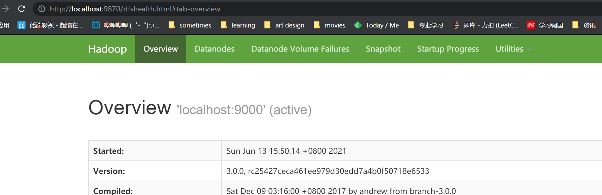 | 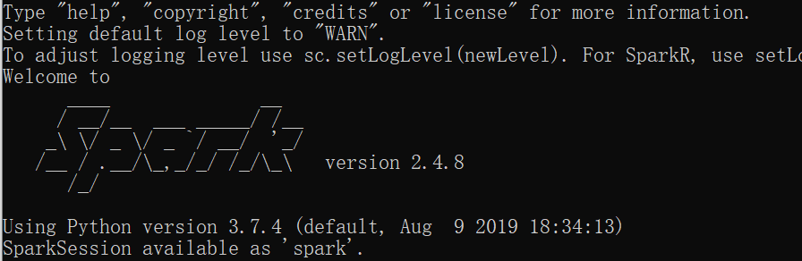 |
| ------------------------------------------------------------ | ------------------------------------------------------------ |
|                                                              |                                                              |


#### 2.实验目的：

1. 学习基于MapReduce框架的分布式计算程序设计方法。

2. 学习基于Spark框架的分布式计算程序设计方法。


#### 3.实验题目

- 准备事件：我们先将需要处理的文件上传到浏览器

  input	  (	child-parent.txt	grades.txt	input_file.txt	)

  input1	(	grades.txt	)

  input2	(	child-parent.txt	)


##### 题目一

输入文件为学生成绩信息，包含了必修课与选修课成绩，格式如下：

班级1, 姓名1, 科目1, 必修, 成绩1

班级2, 姓名2, 科目1, 必修, 成绩2

班级1, 姓名1, 科目2, 选修，成绩3 

………., ………, ………, ………  <br>

 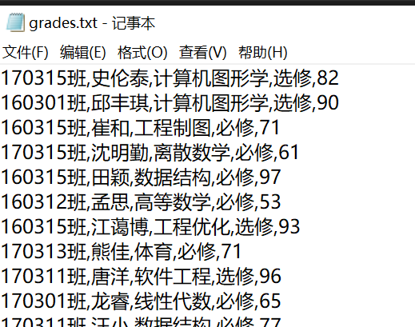

编写两个Hadoop平台上的MapReduce程序，分别实现如下功能：

1. 计算每个学生必修课的平均成绩。

2. 按科目统计每个班的平均成绩。


###### 1.计算每个学生必修课的平均成绩。

- 编写map代码

从数据中选择出**必修**的信息条：key:name    value:score

eg:    170315班,史伦泰,计算机图形学,选修,82			    史伦泰 82
	     160301班,邱丰琪,计算机图形学,选修,90    			邱丰琪 90
	      ........			

```java
@Override
        protected void map(LongWritable key, Text value, Mapper<LongWritable, Text, Text, LongWritable>.Context context)
                throws IOException, InterruptedException {
            String line = value.toString();
            String[] splited = line.split(",");
            String name = splited[1];//名字
            String kind = splited[3];//必修or选修
            Integer score = Integer.parseInt(splited[4]);//分数
            if(kind.equals("必修")){
                context.write(new Text(name), new LongWritable(score));
            }
        }
```

- 编写reduce代码

将新k2，v2----->  k3,v3

eg  张哥<100,90,80>   ---->   求平均数  张哥 90=（100+90+80）/3

```java
@Override
        protected void reduce(Text k2, Iterable<LongWritable> v2s,
                              Reducer<Text, LongWritable, Text, DoubleWritable>.Context context) throws IOException, InterruptedException {
            long count = 0L;
            long sum = 0L;
            double aver;
            for (LongWritable v2 : v2s) {//遍历求和
                count += v2.get();
                sum = sum + 1;
            }
            aver = count*1.0/sum;//防止结果取整数
            DoubleWritable v3 = new DoubleWritable(aver);
            context.write(k2, v3);
        }
```

- 主函数（一般不怎么变化）

```java
public static void main(String[] args) throws Exception {
        Configuration conf = new Configuration();
        //1：创建了一个job任务对象
        Job job = Job.getInstance(conf, MapReduceWordCountDemo.class.getSimpleName());
        //打成jar执行
        job.setJarByClass(MapReduceWordCountDemo.class);

        //2配置job任务对象（八大步骤）
        //第一步：指定文件的读取方式和读取路径
        FileInputFormat.setInputPaths(job, args[0]);
        //FileInputFormat.setInputPaths(job, new Path("http://localhost:9870/explorer.html#/input"));

        //第二步：指定map阶段的处理方式和数据类型
        job.setMapperClass(MyMapper.class);
        //设置map阶段k2的类型
        job.setMapOutputKeyClass(Text.class);
        //设置map阶段v2的类型
        job.setMapOutputValueClass(LongWritable.class);

        //第三四五六采用默认方式

        //第7步：指定reduce阶段的处理方式和数据类型
        job.setReducerClass(MyReducer.class);
        //设置map阶段k3的类型
        job.setOutputKeyClass(Text.class);
        //设置map阶段v3的类型
        job.setOutputValueClass(DoubleWritable.class);

        //第八步：设置输出类型
        FileOutputFormat.setOutputPath(job, new Path(args[1]));

        //交给yarn去执行，直到执行结束才退出本程序
        job.waitForCompletion(true);
    }
```

- 打包jar包--->11.jar（先clean再package）

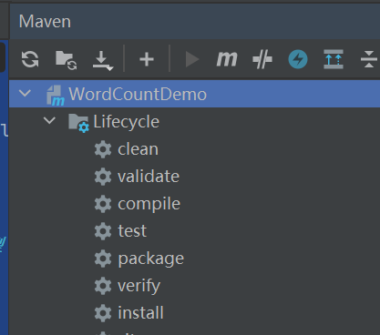

- 运行：如图

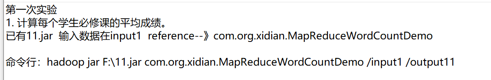

- 运行结果

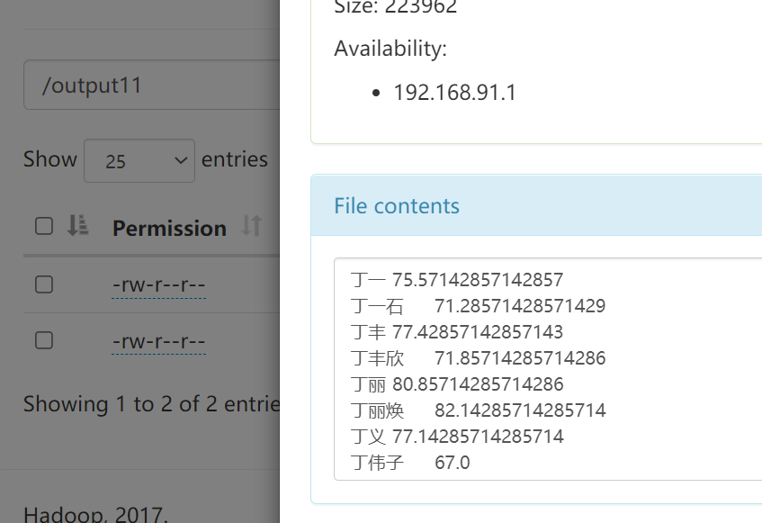


###### 2.按科目统计每个班的平均成绩。

- 编写map代码

从数据中选择出信息条：key:subject+"\t"+banji+"\t"    value:score

eg:    170315班,史伦泰,计算机图形学,选修,82			    计算机图形学 170315班         82
	     160301班,邱丰琪,计算机图形学,选修,90    			计算机图形学 160301班         90
	      ........			

```java
@Override
        protected void map(LongWritable key, Text value, Mapper<LongWritable, Text, Text, LongWritable>.Context context)
                throws IOException, InterruptedException {

            String line = value.toString();
            String[] splited = line.split(",");//分离
            String banji = splited[0];
            String subject = splited[2];
            String feature = subject+"\t"+banji+"\t";
            Integer score = Integer.parseInt(splited[4]);
            context.write(new Text(feature), new LongWritable(score));
        }
```

- 编写reduce代码

将新k2，v2----->  k3,v3

eg  数学  11班<100,90,80>   ---->   求平均数   数学  11班        90=（100+90+80）/3

```java
 @Override
        protected void reduce(Text k2, Iterable<LongWritable> v2s,
                              Reducer<Text, LongWritable, Text, DoubleWritable>.Context context) throws IOException, InterruptedException {
            long count = 0L;
            long sum = 0L;
            double aver;
            for (LongWritable v2 : v2s) {//遍历相加
                count += v2.get();
                sum = sum + 1;
            }
            aver = count*1.0 /sum;//取平均
            DoubleWritable v3 = new DoubleWritable(aver);
            context.write(k2, v3);
        }
```

- 主函数（一般不怎么变化）

```java
public static void main(String[] args) throws Exception {
        Configuration conf = new Configuration();
        //1：创建了一个job任务对象
        Job job = Job.getInstance(conf, MapReduceWordCountDemo.class.getSimpleName());
        //打成jar执行
        job.setJarByClass(MapReduceWordCountDemo.class);

        //2配置job任务对象（八大步骤）
        //第一步：指定文件的读取方式和读取路径
        FileInputFormat.setInputPaths(job, args[0]);
        //FileInputFormat.setInputPaths(job, new Path("http://localhost:9870/explorer.html#/input"));

        //第二步：指定map阶段的处理方式和数据类型
        job.setMapperClass(MyMapper.class);
        //设置map阶段k2的类型
        job.setMapOutputKeyClass(Text.class);
        //设置map阶段v2的类型
        job.setMapOutputValueClass(LongWritable.class);

        //第三四五六采用默认方式

        //第7步：指定reduce阶段的处理方式和数据类型
        job.setReducerClass(MyReducer.class);
        //设置map阶段k3的类型
        job.setOutputKeyClass(Text.class);
        //设置map阶段v3的类型
        job.setOutputValueClass(DoubleWritable.class);

        //第八步：设置输出类型
        FileOutputFormat.setOutputPath(job, new Path(args[1]));

        //交给yarn去执行，直到执行结束才退出本程序
        job.waitForCompletion(true);
    }
```

- 打包jar包--->12.jar（先clean再package）


- 运行：如图

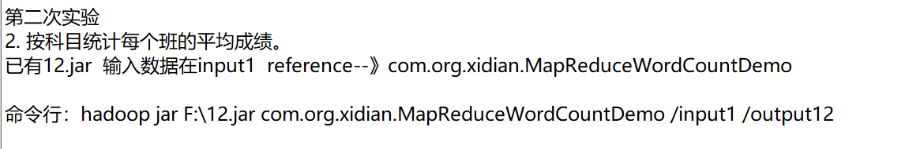

- 运行结果

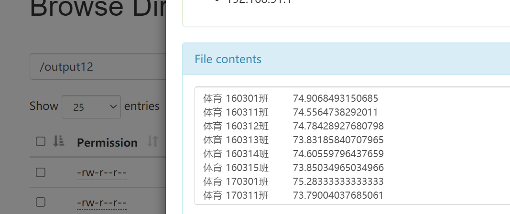


##### 题目二

输入文件的每一行为具有父子/父女/母子/母女/关系的一对人名，例如：

Tim, Andy <br>

Harry, Alice <br>

Mark, Louis <br>

Andy, Joseph <br>

……….., ………… <br>

假定不会出现重名现象。

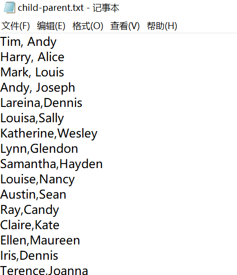

编写Hadoop平台上的MapReduce程序，找出所有具有grandchild-grandparent关系的人名组。


- 编写map代码

从数据中选择出信息条：    key:child            value:"<"+parent

​										      key:parent         value:">"+child																

eg:    儿a，父a1			     儿a <父a1      父a1 >儿a
	      ........			

```java
@Override
        protected void map(LongWritable key, Text value, Mapper<LongWritable, Text, Text, Text>.Context context)
                throws IOException, InterruptedException {
     
            String line = value.toString();
            String[] splited = line.split(",");
            String child = splited[0];
            String parent = splited[1];
            context.write(new Text(child), new Text("<"+parent));
            context.write(new Text(parent), new Text(">"+child));
        }
```

- 编写reduce代码

将新k2，v2----->  k3,v3

eg  儿a<    <a1,<a2,>a3,<a4,>a5     >  转化1  a1,a2,a4      a3,a5      转化2    a3-a1  a3-a2  a3-a4  a5-a1  a5-a2  a5-a4

```java
 @Override
        protected void reduce(Text k2, Iterable<Text> v2s,
                              Reducer<Text, Text, Text, Text>.Context context) throws IOException, InterruptedException {
            ArrayList<Text> grandparent = new ArrayList<Text>();
            ArrayList<Text> grandchild = new ArrayList<Text>();
            for (Text v2 : v2s) {//对各个values中的值进行处理
                String ss = v2.toString();
                String s = ss.substring(0, 1);
                if (s.equals("<")) {
                    grandchild.add(new Text(ss.substring(1)));
                } else {
                    grandparent.add(new Text(ss.substring(1)));
                }
            }
            //再将grandparent与grandchild中的东西，一一对应输出。
            for (int i = 0; i < grandchild.size(); i++) {
                for (int j = 0; j < grandparent.size(); j++) {
                    context.write(grandchild.get(i), grandparent.get(j));
                }
            }
        }
```

- 主函数（一般不怎么变化）

```java
public static void main(String[] args) throws Exception {
        Configuration conf = new Configuration();
        //1：创建了一个job任务对象
        Job job = Job.getInstance(conf, MapReduceWordCountDemo.class.getSimpleName());
        //打成jar执行
        job.setJarByClass(MapReduceWordCountDemo.class);

        //2配置job任务对象（八大步骤）
        //第一步：指定文件的读取方式和读取路径
        FileInputFormat.setInputPaths(job, args[0]);
        //FileInputFormat.setInputPaths(job, new Path("http://localhost:9870/explorer.html#/input"));

        //第二步：指定map阶段的处理方式和数据类型
        job.setMapperClass(MyMapper.class);
        //设置map阶段k2的类型
        job.setMapOutputKeyClass(Text.class);
        //设置map阶段v2的类型
        job.setMapOutputValueClass(LongWritable.class);

        //第三四五六采用默认方式

        //第7步：指定reduce阶段的处理方式和数据类型
        job.setReducerClass(MyReducer.class);
        //设置map阶段k3的类型
        job.setOutputKeyClass(Text.class);
        //设置map阶段v3的类型
        job.setOutputValueClass(DoubleWritable.class);

        //第八步：设置输出类型
        FileOutputFormat.setOutputPath(job, new Path(args[1]));

        //交给yarn去执行，直到执行结束才退出本程序
        job.waitForCompletion(true);
    }
```

- 打包jar包--->2.jar（先clean再package）


- 运行：如图

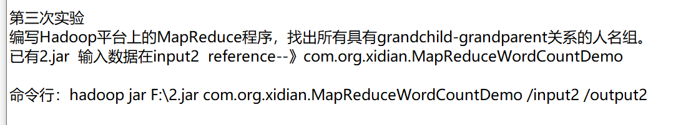

- 运行结果

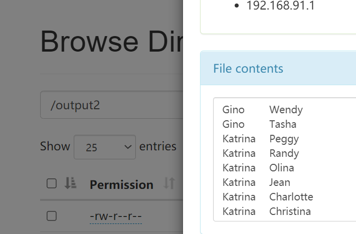


##### 题目三

输入文件为学生成绩信息，包含了必修课与选修课成绩，格式如下：

班级1, 姓名1, 科目1, 必修, 成绩1 <br>

班级2, 姓名2, 科目1, 必修, 成绩2 <br>

班级1, 姓名1, 科目2, 选修，成绩3 <br>

………., ………, ………, ………  <br>


编写一个Spark程序，同时实现如下功能：

1. 计算每个学生必修课的平均成绩。

2. 统计学生必修课平均成绩在：90~100,80~89,70~79,60~69和60分以下这5个分数段的人数。


- 先读入数据

```python
from pyspark import SparkConf,SparkContext
conf = SparkConf().setMaster("local").setAppName("spark")
sc = SparkContext(conf=conf)
textData = sc.textFile("/input1/grades.txt")
```

- 筛选必修课信息条，并选择学生名字和分数列

```python
def select(x):
    m = x.split(",")
    name = m[1]
    score =  int(m[4])
    return (name, score) 
lines = textData.filter(lambda line : "必修" in line).map(lambda x:select(x))
```

- 每个学生必修课的平均成绩

```python
avgData = lines.mapValues(lambda x : (x,1)).reduceByKey(lambda x,y : (x[0]+y[0],x[1] + y[1])).mapValues(lambda x : int(x[0] / x[1]))
avgData.saveAsTextFile("/result01")
```

- 统计分数段人数

```python
def sort(x):
    if(x>=90 and x<=100):
        return ("A", 1) 
    if(x>=80 and x<=89):
        return ("B", 1) 
    if(x>=70 and x<=79):
        return ("C", 1) 
    if(x>=60 and x<=69):
        return ("D", 1) 
    if(x<60):
        return ("E", 1) 
fData = avgData.map(lambda x:sort(x[1])).reduceByKey(lambda x,y : (x+y))
fData.saveAsTextFile("/result02")
```


- 运行：如图

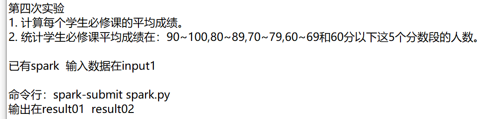

- 运行结果

| 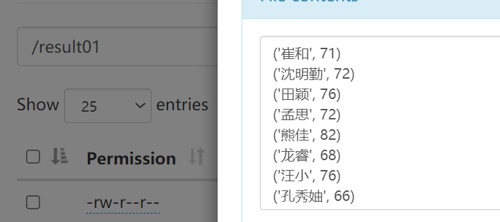 | 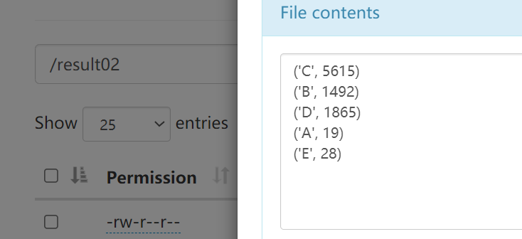 |
| ------------------------------------------------------------ | ------------------------------------------------------------ |
|                                                              |                                                              |

