## grpc书籍信息管理系统

张帅豪   18030100101       老师：李龙海

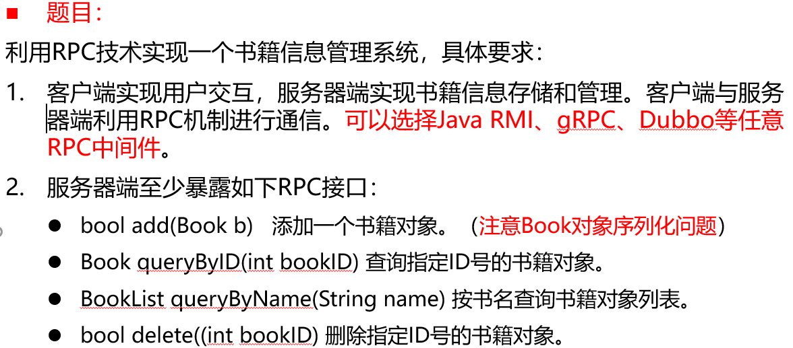

### 问题分析

1. 选择的中间件为grpc
2. 先配置pom.xml(根据老师给的示例，代码比较多，不完全展示)

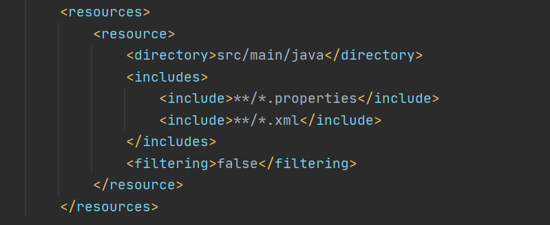

3. 配置proto文件

- 需求分析

> 1.添加书籍
> 2.根据书籍ID查书的信息
> 3.根据书名查书的信息
> 4.根据书籍ID删除书籍
> 5.所有图书图书

```proto
rpc addBook(bookInformation) returns(bookID){};             //添加书籍
rpc searchByID(bookID) returns(bookInformation){};          //根据书籍ID查书的信息
rpc searchByName(bookName) returns(bookID){};   //根据书名查书的信息
rpc deleteByID(bookID) returns(bookInformation){};          //根据书籍ID删除书籍
rpc showBooks(bookID) returns(bookInformation){};            //所有图书
```

> 三个信息类型
>
> 1.书籍ID			2.书籍名字			3.书籍信息（ID ,名字）

```proto
//书籍ID
message bookID{
    string ID = 1;
}
//书籍名字
message bookName{
    string name = 1;
}
//书籍信息
message bookInformation{
    string ID = 1;
    string name = 2;
}
```

4. 在Impl.JAVA文件中重写方法

先用Maven

|                                                              |                                                              |
| ------------------------------------------------------------ | ------------------------------------------------------------ |
| 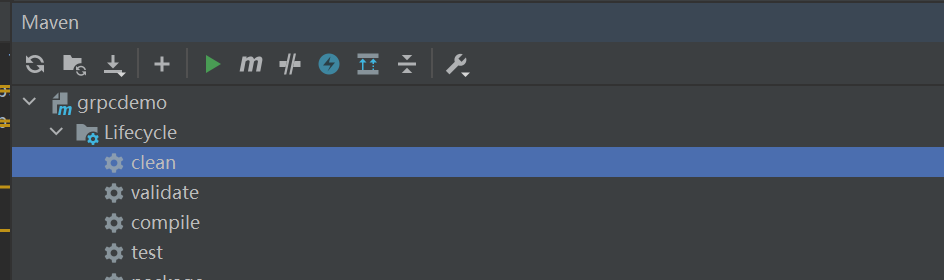 | 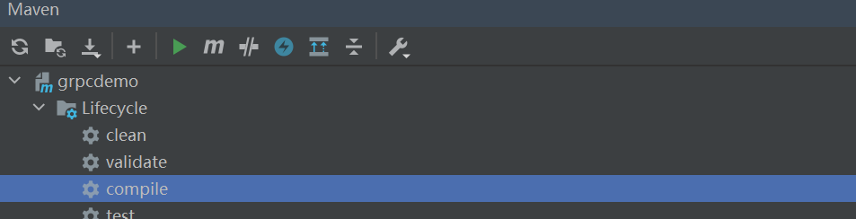 |


> addBook() 	searchByID() 	searchByName() 	deleteByID() 	showBooks() 

我先定义了一个book对象，然后定义一个对象数组

```java
class book{
    private String id;
    private String name;
    public book(String id, String name){
        this.id = id;
        this.name = name;
    }
    public String getID() {return id;}
    public String getName() {return name;}
}
```

```java
 ArrayList<book> bookshelf = new ArrayList<book>();
```

添加书籍addbook()

```java
public void addBook(bookInformation request, StreamObserver<bookID> responseObserver) {
        String id = request.getID();//插入的书籍ID
        String name = request.getName();//插入的书籍名字
        int search = 0;  //来判断该书ID是否已存在
        for(int i = 0;i<bookshelf.size();i++){//遍历判断
            if(bookshelf.get(i).getID().equals(id)){
                search = 1;
                bookID b1 = bookID.newBuilder().setID("不好意思，该书ID已存在").build();
                responseObserver.onNext(b1);
                responseObserver.onCompleted();
            }
        }
        if(search==0){ //书籍ID不存在，可以插入
            bookshelf.add(new book(id,name));//添加书籍
            bookID id1 = bookID.newBuilder().setID(id).build();
            responseObserver.onNext(id1);//返回信息
            responseObserver.onCompleted();
        }
    }
```

根据ID来搜索书籍信息searchByID()

```java
public void searchByID(bookID request, StreamObserver<bookInformation> responseObserver) {
        String id = request.getID();
        int search = 0;
        for(int i = 0;i<bookshelf.size();i++){
            if(bookshelf.get(i).getID().equals(id)){//遍历查询
                search = 1;
                bookInformation b1 = bookInformation.newBuilder().setID(bookshelf.get(i).getID()).
                        setName(bookshelf.get(i).getName()).build();
                responseObserver.onNext(b1);
                responseObserver.onCompleted();
            }
        }
        if(search == 0){//没有相应的信息
            bookInformation b2 = bookInformation.newBuilder().setID("同学你好").
                    setName("未检索到你查询的图书").build();
            responseObserver.onNext(b2);
            responseObserver.onCompleted();
        }
    }
```

根据书籍名字来查找书籍ID searchByName()

```java
 public void searchByName(bookName request, StreamObserver<bookID> responseObserver) {
        String bookname = request.getName();
        String bookid = "";
        int search = 0;
        for(int i = 0;i<bookshelf.size();i++){//遍历查询
            if(bookshelf.get(i).getName().equals(bookname)){
                search = 1;
                bookid = bookid + " "+ bookshelf.get(i).getID();
            }
        }
        if(search==1){//查询到，传输图书ID
            bookID id = bookID.newBuilder().setID(bookid).build();
            responseObserver.onNext(id);
            responseObserver.onCompleted();
        }else {//查不到信息
            bookID id = bookID.newBuilder().setID("未查到书籍信息").build();
            responseObserver.onNext(id);
            responseObserver.onCompleted();
        }
    }
```

根据书籍id删除书籍 deleteByID()

```java
public void deleteByID(bookID request, StreamObserver<bookInformation> responseObserver) {
        String bookid = request.getID();
        int search = 0;
        for (book book : bookshelf) {
            if(book.getID().equals(bookid)){//遍历查询
                search = 1;
                bookshelf.remove(book);//删除book对象
                bookInformation del_book = bookInformation.newBuilder().setID(book.getID()).
                        setName(book.getName()).build();
                responseObserver.onNext(del_book);
                responseObserver.onCompleted();
            }
        }
        if(search==0){//没有查到
            bookInformation del_book = bookInformation.newBuilder().setID(request.getID()).
                    setName("没有书籍信息").build();
            responseObserver.onNext(del_book);
            responseObserver.onCompleted();
        }

    }
```

显示所有图书信息  showBooks()

```java
public void showBooks(bookID request, StreamObserver<bookInformation> responseObserver) {
        String information = "";
        for(int i = 0;i<bookshelf.size();i++){//遍历查询
            information =  information + bookshelf.get(i).getID() +" "
                    + bookshelf.get(i).getName()+ "\n" ;
        }
        bookInformation books = bookInformation.newBuilder().setID("").
                setName(information).build();
        responseObserver.onNext(books);
        responseObserver.onCompleted();
    }
```

5. server.java 的配置

> 基本上和示例的代码相同·，提供连接服务。

```java
private static final int port=9999;
    public static void main(String argc[]) throws IOException, InterruptedException {
        Server server= ServerBuilder.forPort(port).addService(new CalculatorServiceImpl())
                .build().start();
        System.out.println("grpc server started, port="+port);
        server.awaitTermination();
```

6. client.java

先建立连接

```java
 ManagedChannel managedChannel = ManagedChannelBuilder.forAddress(host, serverport).usePlaintext().build();
        try {
            //建立连接
            CalculatorServiceGrpc.CalculatorServiceBlockingStub calService = CalculatorServiceGrpc.newBlockingStub(managedChannel);
```

用switch来选择服务，先写一个菜单说明

| 菜单说明                                                     | 图像显示                                                     |
| ------------------------------------------------------------ | ------------------------------------------------------------ |
| 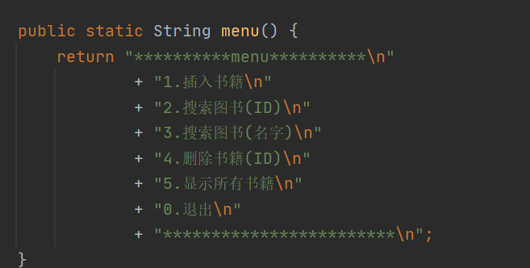 | 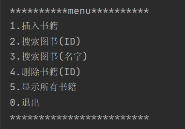 |

来使用switch来选择服务

```java
Scanner input = new Scanner(System.in);
System.out.println(menu());
int choose = input.nextInt();
while (choose != 0) {
   switch(choose) {
      case 1: System.out.println("输入插入的书籍ID 书籍名称\n");
      String newBookID = input.next();
      String newName = input.next();
      bookID book_id = calService.addBook(bookInformation.newBuilder().
      setID(newBookID).setName(newName).build());
      System.out.println("插入了书，编号为 : "+book_id.getID()+" ");
      break;
      case 2: System.out.println("输入查询的书籍ID\n");
      String searchBookID = input.next();
      bookInformation book_information = calService.                               searchByID(bookID.newBuilder().setID(searchBookID).build());
      System.out.println("查询到书籍为 : "+book_information.getID()+" "+book_information.getName());
       break;
       case 3: System.out.println("输入名字查询ID\n");
       String searchBookName = input.next();
       bookID bookid = calService.                         searchByName(bookName.newBuilder().setName(searchBookName).build());
       System.out.println("书籍ID为 : "+bookid.getID()+" ");
       break;
       case 4: System.out.println("输入书籍ID删除书籍信息\n");
       String deleteBookID = input.next();
       bookInformation information = calService.                           deleteByID(bookID.newBuilder().setID(deleteBookID).build());
       System.out.println("删除的信息为 : "+information.getID()+" "+information.getName());
        break;
        case 5: System.out.println("输出所有书籍信息(输入任意信息)\n");
        String noting = input.next();
        bookInformation information1 = calService.
        showBooks(bookID.newBuilder().setID(noting).build());
        System.out.println("所有书籍信息 : "+information1.getID()+"\n"+"ID  "+"书名"+"\n"+information1.getName());
         break;
		 default: System.out.println("再次输入!\n");
         break;
}
         System.out.println(menu());
          choose = input.nextInt();
 }
```


#### 运行示范

| 插入书籍（ID不存在）                                         | 插入书籍（ID已存在）                                         |
| ------------------------------------------------------------ | ------------------------------------------------------------ |
| 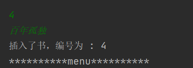 | 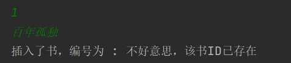 |

| 搜索书籍（ID不存在）                                         | 搜索书籍（ID已存在）                                         |
| ------------------------------------------------------------ | ------------------------------------------------------------ |
| 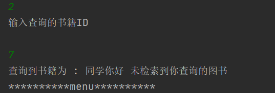 |  |

| 搜索书籍（名字不存在）                                       | 搜索书籍（名字存在）                                         |
| ------------------------------------------------------------ | ------------------------------------------------------------ |
| 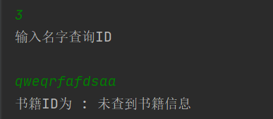 | 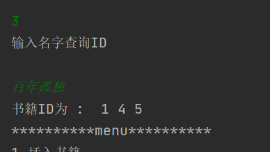 |

| 删除书籍（ID不存在）                                         | 删除书籍（ID已存在）                                         |
| ------------------------------------------------------------ | ------------------------------------------------------------ |
| 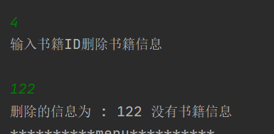 | 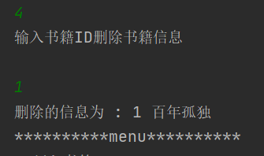 |

| 显示所有的图书                                               |
| ------------------------------------------------------------ |
|  |


