## 第三次作业  分布式随机信号分析系统  （topic）

学号：18030100101       姓名：张帅豪    


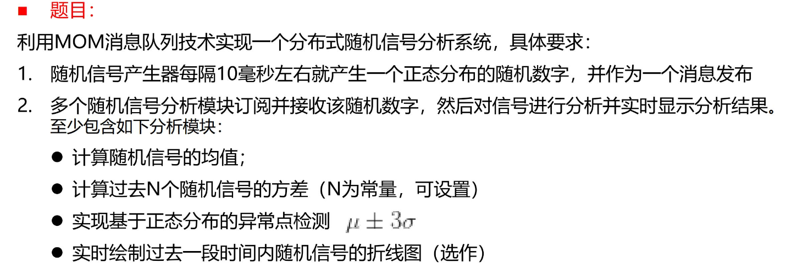

分析问题：

1. 实现一个消息发布 —— 随机信号产生器  Publisher.java

> 消息要求：
>
> 每隔10毫秒左右就产生一个正态分布的随机数字

要点：

- 每隔10ms 用sleep(10L) 来完成
- 正态分布随机数字  ：  用u（均值），v（标准差）

```java
java.util.Random random = new java.util.Random();
double value = v*random.nextGaussian()+u;
```

2. 订阅模块

- 显示随机信号的数值

- 计算随机信号的均值
- 计算随机信号的标准差
- 计算过去N个随机信号的方差(N为常量，可设置）
- 计算过去N个随机信号的均值(N为常量，可设置）
- 实现基于正态分布的异常点检测 u土3v

> 代码设计
>
> - 显示随机信号的数值  AsyncConsumer.java
>
> - 计算随机信号的均值 标准差 average.java
> - 计算过去N个随机信号的均值 方差 aver_n.java
> - 实现基于正态分布的异常点检测 adnormal.java


3. 代码实现

- 随机信号产生器  Publisher.java

首先连接设置

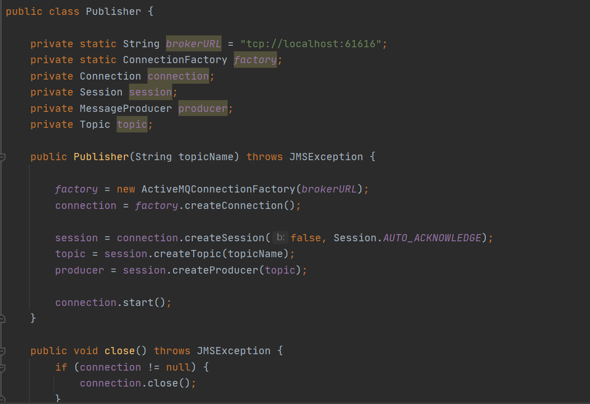

之后重点生成随机数

```java
public static void main(String[] args) throws JMSException, InterruptedException {
    	Publisher publisher = new Publisher("MYTOPIC");
    	int times  = 1000;
    	int i =1;
    	while(times !=0){
    	    sleep(10L);
            publisher.sendMessage(i);
            i++;
            times--;
        }
        publisher.close();


	}
	
    public void sendMessage(int i) throws JMSException {
        double u = 100.0, v = 2.3;
        java.util.Random random = new java.util.Random();
        double value = v*random.nextGaussian()+u;
        String s = Double.toString(value);
        Message message = session.createTextMessage(s);
		producer.send(message);
		System.out.println("Sent a message" +" number: "+ Integer.toString(i));
    }
```


- 显示随机信号的数值  AsyncConsumer.java

连接设置

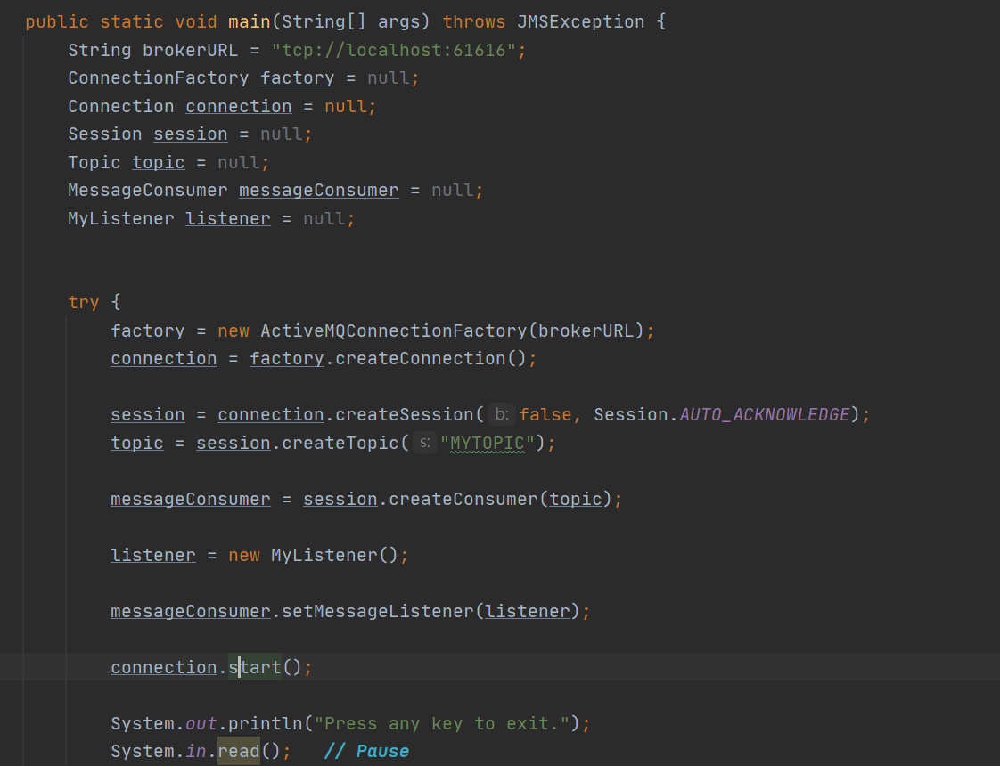

接收队列中的值

```java
public class MyListener implements MessageListener {

	public void onMessage(Message message) {
		try {
			System.out.println("Received a message: "+((TextMessage)message).getText());
		} catch (Exception e) {
			e.printStackTrace();
		}
	}
```

- 计算随机信号的均值 标准差 average.java

连接设置：省略同上

均值，标准差求（所有值）

```java
double sum = 0;
    double aver = 0.0;
    double var = 0.0;
    ArrayList<Double> lists = new ArrayList<Double>();
    @Override
    public void onMessage(Message message) {
        try {
            String s = ((TextMessage)message).getText();
            double value = Double.parseDouble(s);
            lists.add(value);
            sum = 0.0;
            var = 0.0;
            aver = 0.0;
            for (double list : lists) {
                sum += list;
            }
            aver = sum/lists.size();
            double sum_error = 0.0;
            for (double list : lists) {
                sum_error += (aver - list)  * (aver - list);
            }
            var = Math.sqrt(sum_error/lists.size());
            System.out.println("  当前"+lists.size()+"个数字均值为" + aver + " 标准差为：" + var);


        } catch (Exception e) {
            e.printStackTrace();
        }
    }
```


- 计算过去N个随机信号的均值 方差 aver_n.java

连接设置：省略同上

过去N个随机信号的均值 方差

```java
String s = ((TextMessage)message).getText();
            double value = Double.parseDouble(s);
            lists.add(value);
            sum = 0.0;
            aver = 0.0;
            var = 0.0;
            if(lists.size()>=n){
                for (int i = lists.size()-1; i >=lists.size()-n ; i--) {
                    sum += lists.get(i);
                }
                aver = sum/n;
                double sum_error = 0.0;
                for (int i = lists.size()-1; i >=lists.size()-n ; i--) {
                    sum_error += (aver - lists.get(i))  * (aver - lists.get(i));
                }
                var = sum_error/lists.size();
                System.out.println("  过去"+n+"个数字均值为" + aver + "  过去"+n+"个数字方差为" + var);
            }
```

- 实现基于正态分布的异常点检测 adnormal.java

连接设置：省略同上

异常点检测

```java
 String s = ((TextMessage)message).getText();
            double value = Double.parseDouble(s);
            lists.add(value);
            sum = 0.0;
            var = 0.0;
            aver = 0.0;
            for (double list : lists) {
                sum += list;
            }
            aver = sum/lists.size();
            double sum_error = 0.0;
            for (double list : lists) {
                sum_error += (aver - list)  * (aver - list);
            }
            var = Math.sqrt(sum_error/lists.size());
            System.out.print("目前异常值：");
            for (double list : lists) {
                if(list>(aver+3*var) || list <(aver-3*var)){
                    System.out.print(list + " ");
                }
            }
            System.out.println();
```


程序结果

- 首先设置activemq

1. 下载解压
2. 进入bin目录，在cmd运行activemq start


3. 进入网址：http://127.0.0.1:8161/    

默认用户 密码 admin admin 


点击topic页面

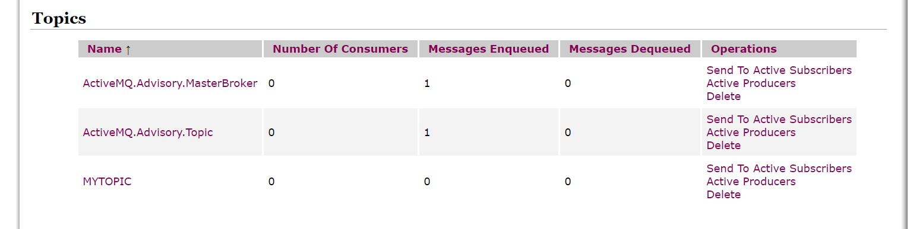

- 运行 显示随机信号的数值  AsyncConsumer.java

- 运行 计算随机信号的均值 标准差 average.java
- 运行· 计算过去N个随机信号的均值 方差 aver_n.java   （令N = 990）

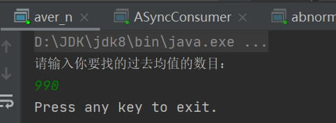

- 运行 实现基于正态分布的异常点检测 adnormal.java
- 运行 随机信号产生器  Publisher.java

| 显示随机信号的数值  AsyncConsumer.java                       | 随机信号的均值 标准差 average.java                           |
| ------------------------------------------------------------ | ------------------------------------------------------------ |
| 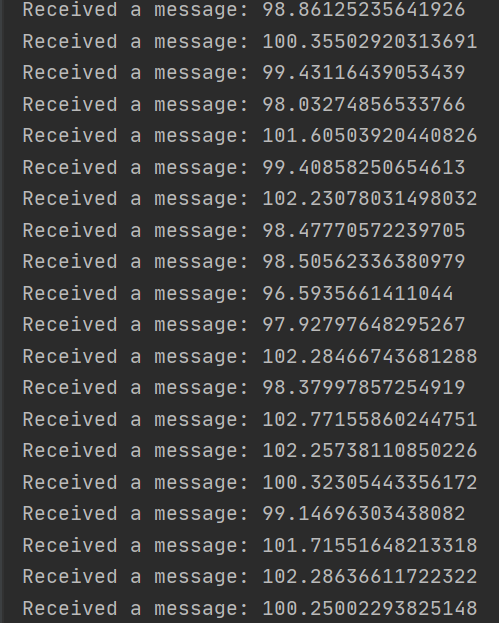 | 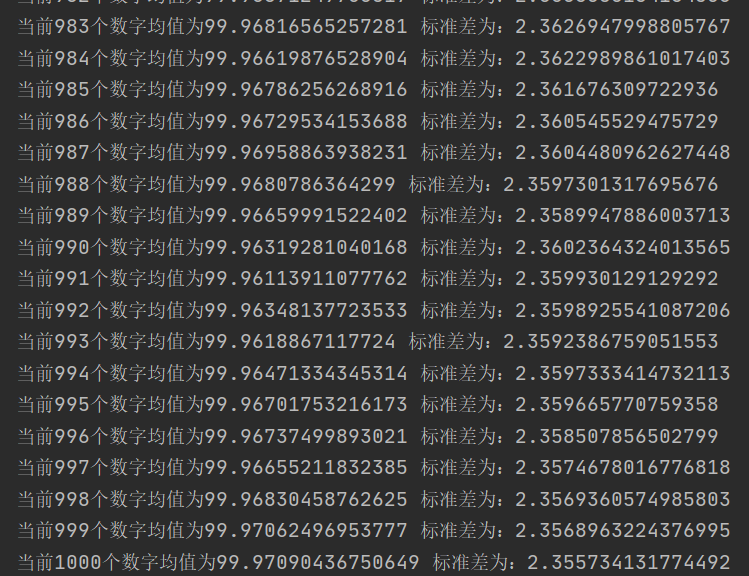 |

| 过去N个随机信号的均值 方差 aver_n.java                       | 实现基于正态分布的异常点检测 adnormal.java                   |
| ------------------------------------------------------------ | ------------------------------------------------------------ |
| 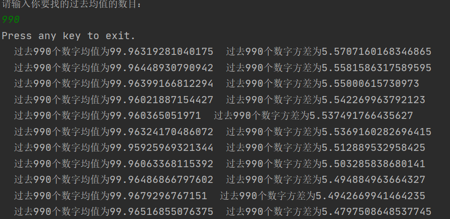 | 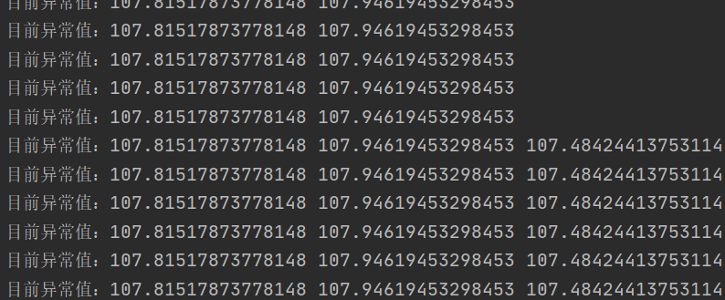 |

| 随机信号产生器  Publisher.java                               | activemq   （topic）                                         |
| ------------------------------------------------------------ | ------------------------------------------------------------ |
| 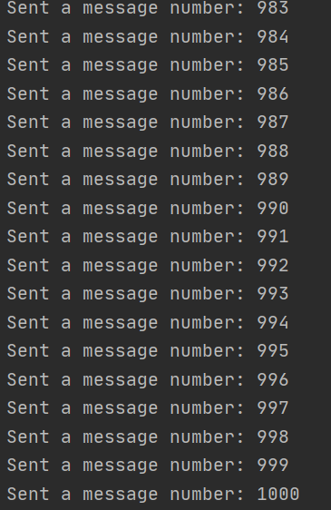 | 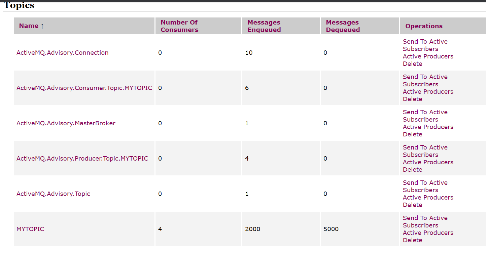 |

