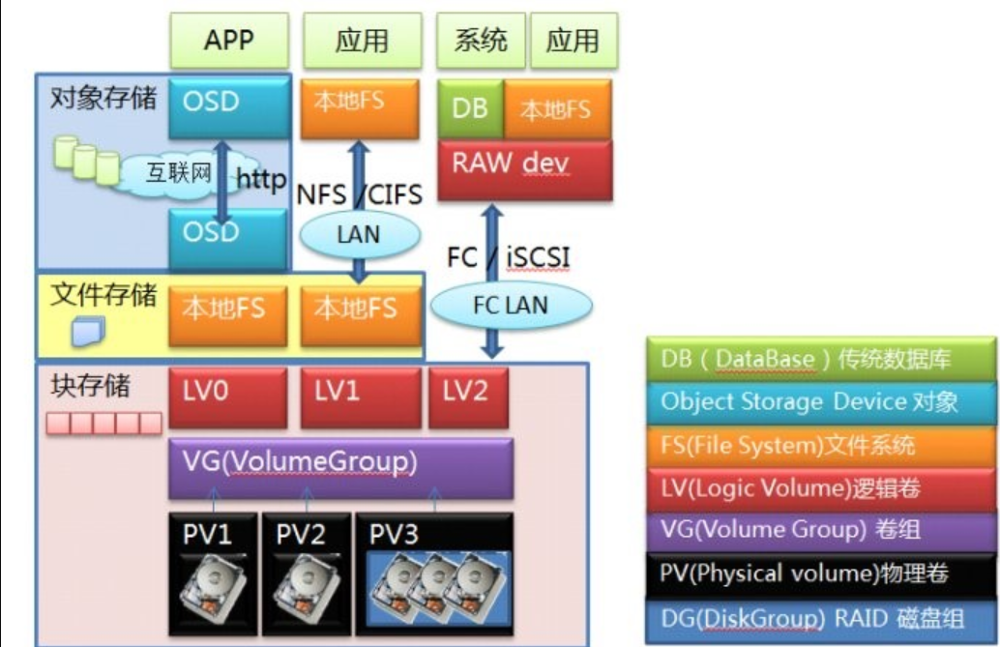
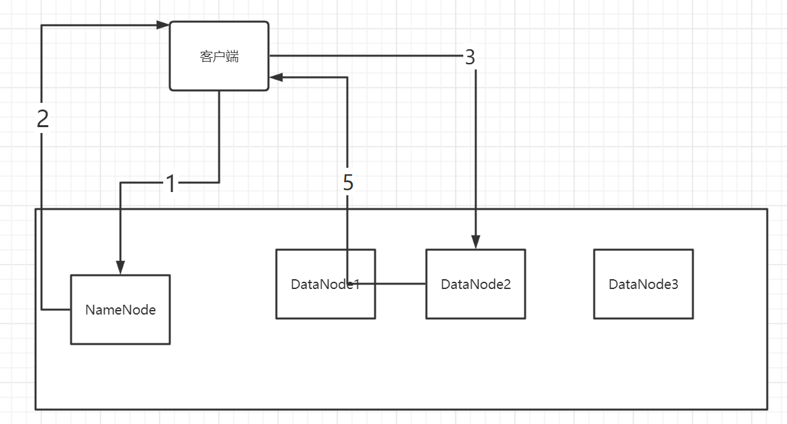
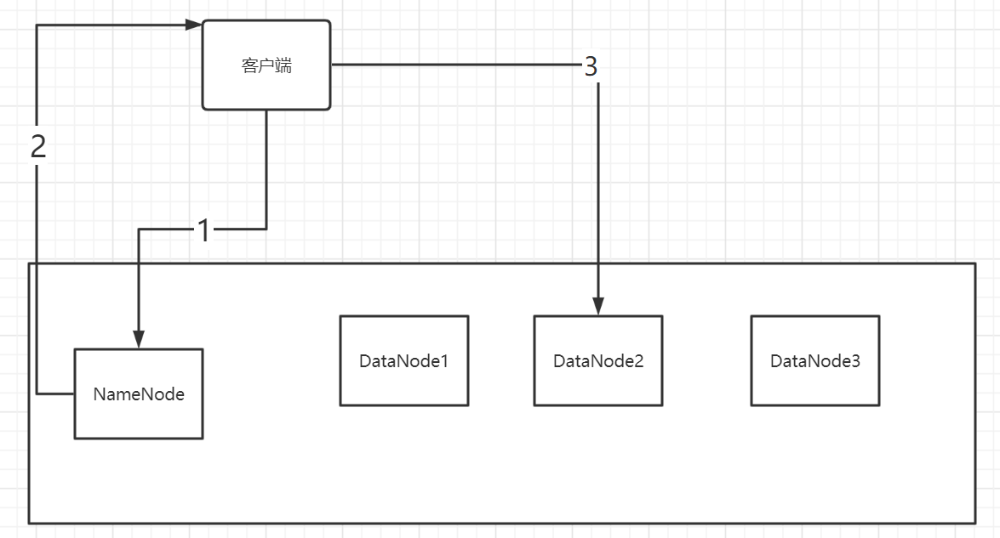

## 第四次作业

学生：张帅豪						老师：李龙海

回答下列问题：

#### 1. 说明三类分布式存储系统的区别：

(1)块存储系统；(2)文件存储系统；(3)对象存储系统。

**（1）块存储系统**

> 块级是指以扇区为基础，一个或我连续的扇区组成一个块，也叫物理块。它是在文件系统与块设备（例如：磁盘驱动器）之间。

块存储会将数据拆分成块，并单独存储各个块。每个数据块都有一个唯一标识符，所以存储系统能将较小的数据存放在最方便的位置。块存储是底层存储，直接写入或读取硬盘扇区（块）。

**（2）文件存储系统**

> 文件级是指文件系统，单个文件可能由于一个或多个逻辑块组成，且逻辑块之间是不连续分布。逻辑块大于或等于物理块整数倍

文件存储会以文件和文件夹的层次结构来整理和呈现数据

文件存储的用户是自然人，最容易理解。所有用于同一用途的数据，按照不同应用程序要求的结构方式组成不同类型的文件，然后我们给每一个文件起一个方便理解记忆的名字。而当文件很多的时候，我们按照某种划分方式给这些文件分组，每一组文件放在同一个目录（或者叫文件夹）里面，当然我们也需要给这些目录起一个容易理解和记忆的名字。而且目录下面除了文件还可以有下一级目录（称之为子目录或者子文件夹），所有的文件、目录形成一个树状结构。

**（3）对象存储**

> 对象存储（Object-based Storage）是一种新的网络存储架构

对象存储，也称为基于对象的存储，是一种扁平结构，其中的文件被拆分成多个部分并散布在多个硬件间。在对象存储中，数据会被分解为称为“对象”的离散单元，并保存在单个存储库中，而不是作为文件夹中的文件或服务器上的块来保存。

对象存储卷会作为模块化单元来工作：每个卷都是一个自包含式存储库，均含有数据、允许在分布式系统上找到对象的唯一标识符以及描述数据的元数据。元数据很重要，其包括年龄、隐私/安全信息和访问突发事件等详细信息。对象存储元数据也可以非常详细，并且能够存储与视频拍摄地点、所用相机和各个帧中特写的演员有关的信息。为了检索数据，存储操作系统会使用元数据和标识符，这样可以更好地分配负载，并允许管理员应用策略来执行更强大的搜索。

|          | 块存储系统                 | 文件存储系统                       | 对象存储系统                                                 |
| -------- | -------------------------- | ---------------------------------- | ------------------------------------------------------------ |
| 一致性   | 最终一致性                 | 强一致性                           | 强一致性                                                     |
| 结构     | 块结构                     | 层次结构                           | 非结构化                                                     |
| 存储设备 | 磁盘阵列，硬盘，虚拟硬盘   | FTP、NFS服务器，SamBa              | 内置大容量硬盘的分布式服务器                                 |
| 优点     | 读写速度最快               | 人可以直接使用，容易管理，价格便宜 | 读写速度和块存储相当，查询速度最快，扩容简单，程序容易管理，安全性较高。 |
| 缺点     | 但查询速度最慢，管理查询难 | 读写速度最慢，安全性较差           | 无法修改对象，必须一次性完整地写入对象                       |

结构关系：

一般来说，我们的系统层级是按照块->文件->对象逐级向上的。对象存储一般是基于文件，也有直接基于块的，但直接基于块比较麻烦。

#### 2.阅读论文《The Hadoop Distributed File System》并回答下面问题：

**①客户端读取HDFS系统中指定文件指定偏移量处的数据时，工作流程是什么？**

1. 客户端在NameNode查在哪里读取文件
2. NameNode发送数据块的信息给客户端
3. 客户端根据数据块信息找到对应的DataNode
4. 在DataNode中根据偏移量找到对应的数据
5. DataNode发送数据给客户端

**②客户端向HDFS系统中指定文件追加写入数据的工作流程是什么？**

1. 客户端把指定文件信息发给NameNode，说明写入
2. NameNode将指定文件对应的DataNode信息发给客户端
3. 客户端发信息给对应的DataNode，写入对应信息。
4. 副本更新

**③新增加一个数据块时，HDFS如何选择存储该数据块的物理节点？**

先增加新快，然后选择副本。

第一个副本：放在上传文件的数据节点，如果集群外提交，随机选一台磁盘不太满、cpu不太忙的节点

第二个副本：放置在与第一个副本不同的机架的节点上

第三个副本：与第一个副本相同机架的其他节点上

更多副本：随机

**④HDFS采用了哪些措施应对数据块损坏或丢失问题？**

通过查询资料，我们知道存在两张表。

> 1.数据块列表
>
> - 数据块1-储存在DN1,DN2
> - 数据库2-储存在DN1,DN4

> 2.DATANODE列表
>
> - DN1-存储数据块1
> - DN2-存储数据块1
> - DN4-存储数据块2

系统会定期检查数据块是否发生生错误。

1. 数据块损坏

更新第一张表（将DN从数据块列表中删去）

再充分备份

2. 数据块丢失

更新两张表

再充分备份

如果我们在读取数据时错误区还未被扫描到，利用信息进行校验，发现出错，客户端就会请求到另外的节点读取，并向名称节点报告，名称节点会定期检测并且重新复制。

**⑤HDFS采用了什么措施应对主节点失效问题？**

这里存在BackupNode，BackupNode上的元数据与NameNode完全一致。因此，基于此可以去掉损坏的NameNode，以NameNode角色重启BackupNode，接替之前的NameNode。再准备一个新的节点，作为新的BackupNode

**⑥NameNode维护的“数据块—物理节点对应表”需不需要在硬盘中备份？为什么？**

不需要，数据块—物理节点对应表的信息可以通过请求NameNode得到最新的文件块位置信息。

因为表的形成就是DataNode形成集群的时候更新形成。

